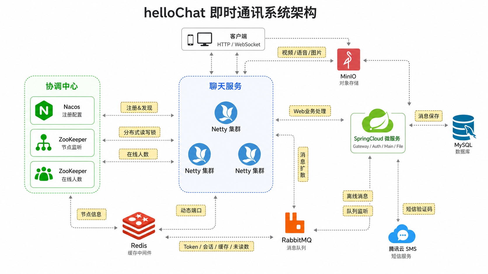

# helloChat


helloChat 是一个面向即时通讯场景的 Java 微服务后端项目。项目基于 Spring Boot、Spring Cloud、Spring Cloud Gateway、Nacos、Redis、RabbitMQ、ZooKeeper、MinIO、MySQL 和 Netty WebSocket 构建，围绕移动端 IM 的核心流程实现了登录认证、用户资料、好友关系、朋友圈、媒体文件、实时聊天、消息持久化和未读消息统计等能力。

这个项目的重点不是单纯提供 CRUD 接口，而是把 IM 系统中比较关键的后端链路串起来：网关统一入口负责鉴权和限流，业务微服务负责用户、好友、朋友圈和聊天记录，独立 Netty 服务负责长连接与实时推送，RabbitMQ 负责消息异步落库和节点广播，Redis 维护 Token、验证码、未读数和 Netty 端口状态，ZooKeeper 维护 Netty 节点信息，MinIO 负责头像、图片、视频、语音和二维码等媒体文件。

## 系统架构

下图参考 IM 集群架构画法，突出 Netty 长连接集群、协调中心、SpringCloud 微服务与消息/存储组件之间的主链路。

<p align="center">
  
</p>

## 项目定位

helloChat 适合作为微服务即时通讯系统的学习和实践项目。它包含了一个聊天后端常见的几类问题：用户如何登录并保持会话、HTTP 请求如何经过网关统一鉴权、WebSocket 长连接如何和业务服务解耦、消息如何同时完成实时投递和持久化、多个 Netty 节点之间如何扩散消息、媒体文件如何独立存储、客户端如何选择在线人数较少的聊天节点。

项目当前更偏后端服务端实现，前端或客户端可以通过 HTTP API 完成业务操作，通过 WebSocket 与 Netty 服务建立长连接。服务之间使用 Nacos 做注册发现，使用 OpenFeign 做内部 HTTP 调用，使用 RabbitMQ 和 Redis 处理高频状态与异步消息。

## 功能特性

- 认证与会话：手机号短信验证码、注册、登录、一键注册登录、退出登录、JWT Token 生成、Redis 分布式会话保存。
- 网关能力：统一 API 入口、Nacos 服务发现、路由转发、跨域配置、Token 校验、IP 访问频率限制。
- 用户资料：昵称、手机号、微信号、头像、个人二维码、朋友圈背景、聊天背景、用户搜索。
- 好友体系：好友申请、新朋友列表、通过申请、联系人列表、备注修改、拉黑、移出黑名单、黑名单查询、删除好友。
- 朋友圈：图文发布、朋友圈分页查询、点赞、取消点赞、点赞人列表、评论发布、评论查询、评论删除。
- 文件服务：头像上传、朋友圈图片上传、聊天图片上传、聊天视频上传、聊天语音上传、背景图上传、二维码生成、视频封面截取。
- 即时通讯：Netty WebSocket 长连接、连接初始化、心跳保活、文本消息、图片消息、视频消息、语音消息、多端同步。
- 消息链路：RabbitMQ 异步保存聊天消息，Fanout 广播到 Netty 节点，Redis 维护未读消息数量。
- 节点协调：ZooKeeper 维护 Netty 节点注册信息和在线人数，主业务服务可返回当前连接数较少的 Netty 节点。

## 技术栈

| 分类 | 技术 |
| --- | --- |
| 语言与构建 | Java 21, Maven |
| 微服务框架 | Spring Boot 4.0.5, Spring Cloud 2025.1.1, Spring Cloud Alibaba 2025.1.0.0 |
| 网关与注册配置 | Spring Cloud Gateway WebFlux, Nacos Discovery, Nacos Config |
| 服务调用 | OpenFeign, Spring Cloud LoadBalancer, OkHttp |
| 数据访问 | MyBatis-Plus 3.5.16, MySQL, HikariCP |
| 缓存与会话 | Redis, Spring Data Redis, Jedis |
| 实时通信 | Netty 4.2.12.Final, WebSocket |
| 消息队列 | RabbitMQ, Spring AMQP |
| 节点协调 | ZooKeeper 3.9.5, Curator 5.9.0 |
| 文件存储 | MinIO 8.4.5 |
| 辅助能力 | JJWT, Lombok, Validation, AspectJ, ZXing, JCodec, 腾讯云 SMS |

## 模块说明

| 模块 | 端口 | 类型 | 说明 |
| --- | --- | --- | --- |
| `helloChat-gateway-1000` | `1000` | Spring Boot 网关服务 | 系统统一入口，负责跨域、路由、Token 校验、IP 限流，将请求转发到认证、文件和主业务服务。 |
| `helloChat-api/auth-service-88` | `88` | Spring Boot 业务服务 | 负责短信验证码、注册、登录、一键注册登录、退出登录、用户初始资料创建和二维码生成调用。 |
| `helloChat-api/main-service-66` | `66` | Spring Boot 业务服务 | 负责用户资料、好友申请、好友关系、朋友圈、评论、聊天记录、未读数、Netty 节点选择。 |
| `helloChat-api/file-service-55` | `55` | Spring Boot 文件服务 | 负责 MinIO 文件上传、二维码生成、视频封面截取，并通过 Feign 回写用户头像和背景图。 |
| `helloChat-chat-875` | `875` 起 | 独立 Netty 服务 | 不是 Spring Boot Web 服务，负责 WebSocket 连接、Channel 管理、消息接收、消息扩散和集群广播。 |
| `helloChat-api/base-service` | - | 公共基础模块 | 封装 OpenFeign 客户端和 RabbitMQ 配置，供业务服务复用。 |
| `helloChat-common` | - | 公共工具模块 | 提供统一响应、异常处理、Redis 工具、JWT、短信、二维码、拦截器、基础常量等能力。 |
| `helloChat-pojo` | - | 数据模型模块 | 存放 Entity、BO、VO、Netty 消息 DTO 等跨模块共享对象。 |

## 目录结构

```text
helloChat
├── helloChat-api
│   ├── auth-service-88       # 认证服务：短信、注册、登录、Redis 会话
│   ├── base-service          # Feign 客户端、RabbitMQ 配置
│   ├── file-service-55       # 文件服务：MinIO、二维码、视频封面
│   └── main-service-66       # 主业务：用户、好友、朋友圈、聊天记录
├── helloChat-chat-875        # Netty WebSocket 聊天服务
├── helloChat-common          # 公共配置、工具类、异常、统一响应、拦截器
├── helloChat-gateway-1000    # Spring Cloud Gateway 网关
├── helloChat-pojo            # Entity / BO / VO / Netty DTO
├── docs
│   └── images
│       └── architecture.png  # README 系统架构图
├── pom.xml                   # Maven 父工程
└── README.md
```

## 架构解读

### 接入层

客户端的 HTTP 请求统一进入 `helloChat-gateway-1000`。网关根据路径将请求转发到对应微服务：

- `/passport/**` 转发到 `auth-service`
- `/file/**`、`/static/**` 转发到 `file-service`
- `/userInfo/**`、`/friendRequest/**`、`/friendship/**`、`/friendCircle/**`、`/comment/**`、`/chat/**` 转发到 `main-service`

网关中的 `SecurityFilterToken` 会读取请求头里的 `headerUserTokenKey` 和 `headerUserToken`，到 Redis 中校验登录态。校验通过后，网关把用户 ID 写入 `headerUserId`，下游 Servlet 服务再通过 `UserInfoInterceptor` 将用户信息写入 `UserContext`。

`IPLimitFilter` 负责基于 Redis 的 IP 访问频率限制。当前实现通过 Redis 自增和过期时间完成计数，适合作为限流机制的基础版本。

### 业务服务层

认证服务负责用户登录前后的身份链路。短信验证码按手机号和 IP 维度写入 Redis，用户登录成功后生成 JWT，并把 Token 按 `redis_user_token:{userId}:{deviceCode}` 的形式保存到 Redis 中，从而支持多端登录和同端互斥控制。

主业务服务负责 IM 周边业务，包括用户资料、好友关系、朋友圈、评论和聊天记录。聊天相关 HTTP 接口主要用于查询历史消息、查询未读数、清空未读数、标记语音消息已读，以及返回连接数较少的 Netty 节点。

文件服务负责媒体文件处理。头像、朋友圈图片、聊天图片、聊天视频、聊天语音和背景图都会上传到 MinIO。视频消息会通过 JCodec 截取封面，二维码通过 ZXing 生成后写入对象存储。

### 实时通信层

`helloChat-chat-875` 是独立 Netty 服务。客户端通过主业务服务获取 Netty 节点信息后，与 Netty 建立 WebSocket 连接。连接初始化时，Netty 将用户 ID 和 Channel 进行绑定，并把用户所在 Netty 节点写入 Redis，同时通过 ZooKeeper 更新节点在线人数。

消息到达 Netty 后，会根据消息类型执行不同逻辑：

- 心跳消息：用于保持连接活跃。
- 连接初始化消息：建立用户和 Channel 的对应关系。
- 文本、图片、视频、语音消息：校验黑名单关系，生成消息 ID，发送到 RabbitMQ，随后广播给其他 Netty 节点。

当前 `UserChannelSession` 使用本机内存维护用户和 Channel 的多端关系，因此单个 Netty 节点内可以支持同一账号多设备同步。跨节点消息通过 RabbitMQ Fanout 广播完成。

### 消息与存储层

RabbitMQ 在项目中承担两类职责：

- Topic 消息：Netty 将聊天消息发送到 `helloChat_exchange`，路由键为 `helloChat.msg.send`，主业务服务消费后写入 MySQL。
- Fanout 广播：Netty 将待投递消息发送到 `fanout_exchange`，所有 Netty 节点监听自己的队列并尝试投递给本机连接的目标用户。

Redis 在项目中承担验证码、Token、未读数和 Netty 状态缓存等职责。典型 Key 包括：

- `mobile:smscode:{mobile}`：短信验证码。
- `redis_user_token:{userId}:{deviceCode}`：用户登录 Token。
- `chat_msg_list:{receiverId}`：接收方未读消息计数。
- `netty_port`：Netty 节点端口和在线人数状态。

MySQL 负责保存用户、好友、朋友圈、评论和聊天消息等核心业务数据。MinIO 负责保存头像、二维码、朋友圈图片、聊天图片、视频、语音等媒体资源。ZooKeeper 负责维护 Netty 服务节点和在线人数，供客户端选择更合适的连接节点。

## 核心流程

### 登录鉴权流程

1. 客户端调用 `/passport/getSMSCode` 获取短信验证码。
2. 认证服务根据 IP 做验证码获取频率限制，并将验证码写入 Redis。
3. 客户端调用 `/passport/login`、`/passport/registry` 或 `/passport/registryOrLogin` 完成认证。
4. 认证服务生成 JWT，并将 `redis_user_token:{userId}:{deviceCode}` 写入 Redis。
5. 客户端后续请求携带 `headerUserTokenKey` 和 `headerUserToken`。
6. 网关校验 Redis 中的 Token，校验通过后将 `headerUserId` 透传给下游服务。
7. 下游服务通过拦截器将用户 ID 放入 `UserContext`，业务代码直接读取当前用户。
8. 客户端退出登录时调用 `/passport/logout`，服务端删除 Redis 中对应 Token。

### 好友关系流程

1. 用户通过 `/userInfo/queryFriend` 搜索用户。
2. 调用 `/friendRequest/add` 发起好友申请。
3. 对方通过 `/friendRequest/queryNew` 查看新朋友列表。
4. 对方调用 `/friendRequest/pass` 通过申请。
5. 服务端会为双方分别写入好友关系记录。
6. 用户可以通过 `/friendship/queryMyFriends` 查询联系人，通过 `/friendship/tobeBlack` 和 `/friendship/moveOutBlack` 管理黑名单。
7. Netty 发送聊天消息前会调用 `/friendship/isBlack` 判断双方是否存在黑名单关系。

### 聊天消息流程

1. 客户端调用 `/chat/getNettyOnlineInfo` 获取当前在线人数较少的 Netty 节点。
2. 客户端与该 Netty 节点建立 WebSocket 连接。
3. 客户端发送连接初始化消息，Netty 绑定 `userId -> Channel` 和 `channelId -> userId`。
4. 客户端发送文本、图片、视频或语音消息。
5. Netty 调用网关接口校验双方黑名单关系。
6. Netty 为消息生成唯一 ID，并发送到 RabbitMQ Topic 交换机。
7. `main-service-66` 监听队列，将聊天消息保存到 MySQL，并累加 Redis 未读数。
8. Netty 将消息发送到 RabbitMQ Fanout 交换机。
9. 所有 Netty 节点收到广播后，根据本机 Channel 会话投递给接收方在线设备，并同步给发送方其他设备。
10. 客户端可调用 `/chat/list/{senderId}/{receiverId}` 查询历史记录，调用 `/chat/getMyUnReadCounts` 查询未读数，调用 `/chat/clearMyUnReadCounts` 清空未读数。

### 文件上传流程

1. 客户端将文件提交到 `file-service-55`。
2. 文件服务根据业务类型组织对象路径，并上传到 MinIO。
3. 头像、朋友圈背景、聊天背景等资料类文件会通过 OpenFeign 调用 `main-service-66` 更新用户资料。
4. 聊天视频上传后，服务端使用 JCodec 抽取视频封面，并返回视频地址和封面地址。
5. 个人二维码由认证服务创建用户时触发文件服务生成，并保存到 MinIO。

## API 分组

| 分组 | 主要接口 | 说明 |
| --- | --- | --- |
| 认证 | `GET /passport/getSMSCode` | 获取短信验证码。 |
| 认证 | `POST /passport/registry` | 注册新用户。 |
| 认证 | `POST /passport/login` | 手机号验证码登录。 |
| 认证 | `POST /passport/registryOrLogin` | 一键注册或登录。 |
| 认证 | `POST /passport/logout` | 删除 Redis Token，退出登录。 |
| 用户 | `POST /userInfo/modify` | 修改用户资料。 |
| 用户 | `POST /userInfo/get` | 查询用户资料。 |
| 用户 | `POST /userInfo/queryFriend` | 搜索好友。 |
| 好友申请 | `POST /friendRequest/add` | 发送好友申请。 |
| 好友申请 | `POST /friendRequest/queryNew` | 查询新朋友申请列表。 |
| 好友申请 | `POST /friendRequest/pass` | 通过好友申请。 |
| 好友关系 | `POST /friendship/queryMyFriends` | 查询联系人。 |
| 好友关系 | `POST /friendship/updateFriendRemark` | 修改好友备注。 |
| 好友关系 | `POST /friendship/tobeBlack` | 拉黑好友。 |
| 好友关系 | `POST /friendship/moveOutBlack` | 移出黑名单。 |
| 好友关系 | `GET /friendship/isBlack` | 判断双方是否存在黑名单关系。 |
| 朋友圈 | `POST /friendCircle/publish` | 发布朋友圈。 |
| 朋友圈 | `POST /friendCircle/queryList` | 分页查询朋友圈。 |
| 朋友圈 | `POST /friendCircle/like` | 点赞朋友圈。 |
| 朋友圈 | `POST /friendCircle/unlike` | 取消点赞。 |
| 评论 | `POST /comment/create` | 发布评论。 |
| 评论 | `POST /comment/query` | 查询朋友圈评论。 |
| 聊天 | `POST /chat/getNettyOnlineInfo` | 获取推荐连接的 Netty 节点。 |
| 聊天 | `POST /chat/list/{senderId}/{receiverId}` | 查询聊天记录。 |
| 聊天 | `POST /chat/getMyUnReadCounts` | 查询当前用户未读数。 |
| 聊天 | `POST /chat/clearMyUnReadCounts` | 清空指定会话未读数。 |
| 文件 | `POST /file/uploadFace` | 上传头像。 |
| 文件 | `POST /file/uploadFriendCircleImage` | 上传朋友圈图片。 |
| 文件 | `POST /file/uploadChatPhoto` | 上传聊天图片。 |
| 文件 | `POST /file/uploadChatVideo` | 上传聊天视频并返回封面。 |
| 文件 | `POST /file/uploadChatVoice` | 上传聊天语音。 |

## 快速开始

### Docker 一键部署

项目根目录下已经提供 `docker` 目录，拉取项目后不需要先手动执行 `mvn package`，也不需要提交或准备各模块的 `target/` 目录。业务镜像会在 Docker 构建阶段从源码执行 Maven 打包。

```bash
cd docker
docker compose up -d
```

首次启动会构建并启动网关、认证服务、主业务服务、文件服务和 3 个 Netty 聊天服务实例，同时启动 MySQL、Redis、RabbitMQ、ZooKeeper、Nacos 和 MinIO。MySQL 首次启动时会自动导入根目录的 `Hchat.sql`。

默认访问入口：

- HTTP 网关：`http://localhost:1000`
- Netty WebSocket：`localhost:875`、`localhost:885`、`localhost:895`
- Nacos 控制台：`http://localhost:18080`
- RabbitMQ 控制台：`http://localhost:15672`，账号/密码 `nlizzard` / `nlizzard`
- MinIO 控制台：`http://localhost:9001`，账号/密码 `minio` / `miniominio`
- MySQL：`localhost:3306`
- Redis：`localhost:6379`

RabbitMQ、MySQL、Redis、MinIO、ZooKeeper 的数据会挂载到 `docker` 目录下对应的数据目录中，这些运行时数据目录已被 `.gitignore` 忽略。RabbitMQ 当前只挂载 `docker/rabbitmq_data/mnesia`，`.erlang.cookie` 保留在容器内部，避免 Windows 目录权限导致 RabbitMQ 启动失败。

默认会启动 3 个 Netty 实例，容器内外端口分别为 `875`、`885`、`895`。每个实例会把自己的 `NETTY_ADVERTISED_HOST + 端口` 注册到 ZooKeeper，`main-service` 的 `/chat/getNettyOnlineInfo` 会返回当前在线人数较少的节点给客户端。

如果客户端不在 Docker 主机本机运行，需要在启动前指定 Netty 对外暴露地址：

```bash
# Linux / macOS / Git Bash
NETTY_ADVERTISED_HOST=192.168.1.10 docker compose up -d

# Windows PowerShell
$env:NETTY_ADVERTISED_HOST="192.168.1.10"; docker compose up -d
```

修改源码后需要重新构建业务镜像时执行：

```bash
docker compose up -d --build
```

更多端口和环境变量说明见 `docker/README.md`。

### 环境要求

- JDK 21
- Maven 3.9+
- MySQL
- Redis
- RabbitMQ
- ZooKeeper
- Nacos
- MinIO

### 配置说明

当前项目默认使用 `dev` profile。启动前需要根据本机环境调整以下配置：

| 配置文件 | 说明 |
| --- | --- |
| `helloChat-gateway-1000/src/main/resources/application.yml` | 网关端口、Nacos、Redis、路由和跨域配置。 |
| `helloChat-gateway-1000/src/main/resources/application-dev.yml` | 网关开发环境变量。 |
| `helloChat-api/auth-service-88/src/main/resources/application.yml` | 认证服务端口、MySQL、Redis、Nacos 配置。 |
| `helloChat-api/auth-service-88/src/main/resources/application-dev.yml` | 认证服务开发环境变量。 |
| `helloChat-api/main-service-66/src/main/resources/application.yml` | 主业务服务 MySQL、Redis、RabbitMQ、ZooKeeper、Nacos 配置。 |
| `helloChat-api/main-service-66/src/main/resources/application-dev.yml` | 主业务服务开发环境变量。 |
| `helloChat-api/file-service-55/src/main/resources/application.yml` | 文件服务端口、Nacos 和上传限制配置。 |
| `helloChat-api/file-service-55/src/main/resources/application-dev.yml` | MinIO endpoint、bucket、accessKey、secretKey。 |
| `helloChat-common/src/main/resources/tencentCloud.properties` | 腾讯云短信配置。 |

需要重点检查的基础设施：

- Nacos：服务注册发现和部分配置导入。
- MySQL：用户、好友、朋友圈、聊天消息等数据表。
- Redis：验证码、Token、未读数和 Netty 状态。
- RabbitMQ：聊天消息落库队列和 Netty 广播交换机。
- ZooKeeper：Netty 节点注册和在线人数统计。
- MinIO：头像、背景图、聊天媒体和二维码。
- 腾讯云 SMS：短信验证码发送。

生产环境请不要直接使用开发配置中的账号、密码和内网地址，建议将敏感信息放入环境变量、配置中心或密钥管理系统。

### 编译项目

```bash
mvn clean package -DskipTests
```

### 启动顺序

先启动基础设施：Nacos、MySQL、Redis、RabbitMQ、ZooKeeper、MinIO。

然后启动 Spring Boot 微服务：

```bash
mvn -pl helloChat-api/auth-service-88 -am spring-boot:run
mvn -pl helloChat-api/main-service-66 -am spring-boot:run
mvn -pl helloChat-api/file-service-55 -am spring-boot:run
mvn -pl helloChat-gateway-1000 -am spring-boot:run
```

最后启动 Netty 聊天服务：

```bash
java -jar helloChat-chat-875/target/helloChat-chat-875-1.0.jar
```

如果需要启动多个 Netty 节点，可以显式传入端口：

```bash
java -jar helloChat-chat-875/target/helloChat-chat-875-1.0.jar 875
java -jar helloChat-chat-875/target/helloChat-chat-875-1.0.jar 885
```

### 启动后检查

- 网关是否启动在 `1000` 端口。
- `auth-service`、`main-service`、`file-service` 是否成功注册到 Nacos。
- Redis 中是否能写入短信验证码和登录 Token。
- RabbitMQ 中是否存在 `helloChat_queue`、`helloChat_exchange` 等消息组件。
- ZooKeeper 中是否出现 Netty 节点注册信息。
- MinIO bucket 是否存在，文件上传后是否能访问。
- 客户端调用 `/chat/getNettyOnlineInfo` 是否能拿到 Netty 节点。

## 设计亮点

- 网关统一鉴权：登录态校验集中在 Gateway，业务服务通过请求头和拦截器获取当前用户，避免每个 Controller 重复解析 Token。
- Redis 分布式会话：JWT 不是纯无状态使用，而是与 Redis Token Key 配合，便于退出登录、过期刷新和多端控制。
- Netty 与业务服务解耦：WebSocket 长连接由独立 Netty 服务维护，消息持久化交给 RabbitMQ 和主业务服务，降低实时链路与业务写库之间的耦合。
- 多端在线模型：同一用户可以维护多个 Channel，接收方多设备可同步收到消息，发送方其他设备也能收到同步消息。
- RabbitMQ 双链路：Topic 用于消息落库，Fanout 用于 Netty 节点间广播，分别解决可靠保存和在线投递的问题。
- ZooKeeper 节点协调：Netty 节点启动后注册自身信息，主业务服务可根据在线人数返回更合适的节点给客户端。
- MinIO 媒体解耦：聊天图片、语音、视频、头像和二维码不直接存入数据库，而是通过对象存储保存 URL。

## 当前边界与优化方向

- Netty 服务中的 RabbitMQ、Redis、ZooKeeper 地址目前偏硬编码，后续可以统一接入配置中心。
- `UserChannelSession` 使用本机内存 `HashMap` 管理 Channel，单机内多端同步清晰，但大规模集群下可以进一步抽象在线状态。
- Netty 消息处理中的黑名单校验通过同步 HTTP 调用完成，后续可以改为异步调用、本地缓存或事件驱动同步。
- 网关 IP 限流当前使用 Redis 自增和过期时间组合，后续可以升级为 Lua 原子脚本或 Gateway `RequestRateLimiter`。
- 当前 README 只描述启动方式，后续可以补充数据库初始化脚本、接口文档、Docker Compose 和自动化测试。
- 生产环境需要补充日志追踪、指标监控、消息失败重试、死信队列、离线推送和灰度发布能力。

## License

本项目基于 [MIT License](LICENSE) 开源。
